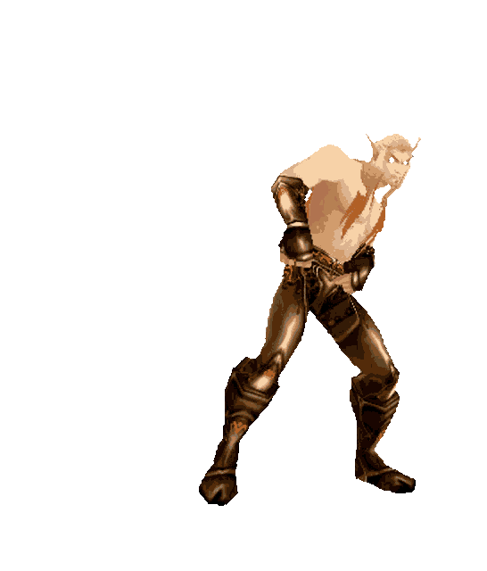

<!--
**lucasdonini0/lucasdonini0** is a ✨ _special_ ✨ repository because its `README.md` (this file) appears on your GitHub profile.

Here are some ideas to get you started:

- 🔭 I’m currently working on ...
- 🌱 I’m currently learning ...
- 👯 I’m looking to collaborate on ...
- 🤔 I’m looking for help with ...
- 💬 Ask me about ...
- 📫 How to reach me: ...
- 😄 Pronouns: ...
- ⚡ Fun fact: ...
-->
<h2 align="left">Olá! Eu sou o Lucas ✌️</h2>

<i>“Remember, no matter how dark the night, the Light will guide us.”</i> 
— Uther the Lightbringer

#

  

 • Desenvolvedor Back-End

 • PT-BR / ENG

  

  

    <h6>⚒️ Tecnologias que uso:</h6>
    
    
    
     
  

  

  

  
   

---
<!-- Aqui vai a cobrinha

  

